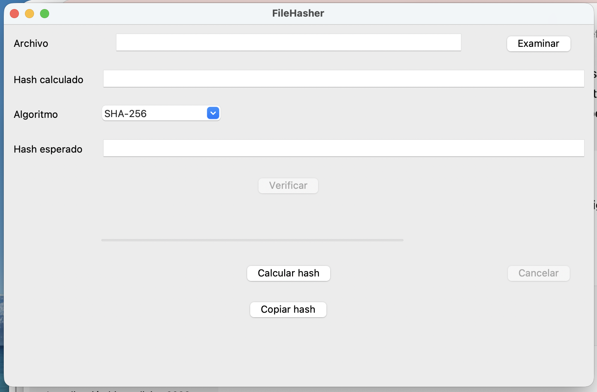
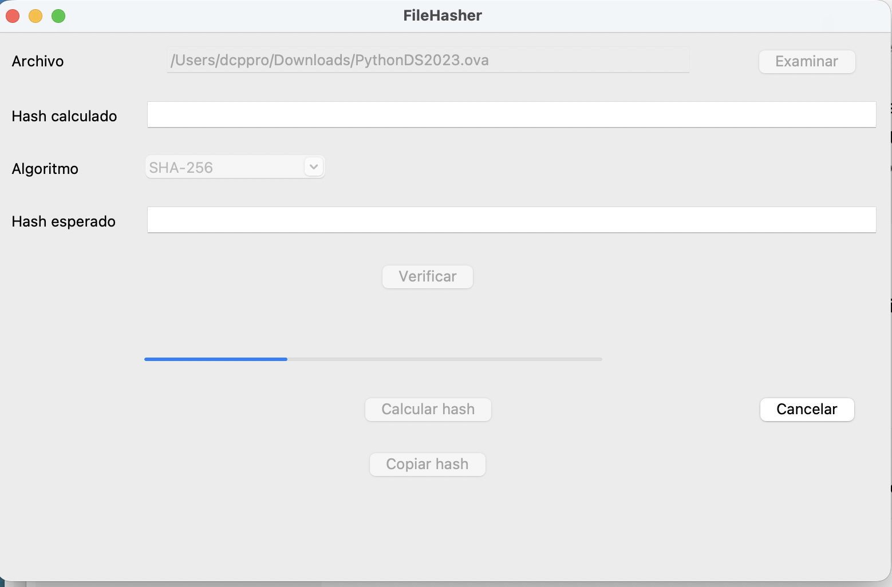
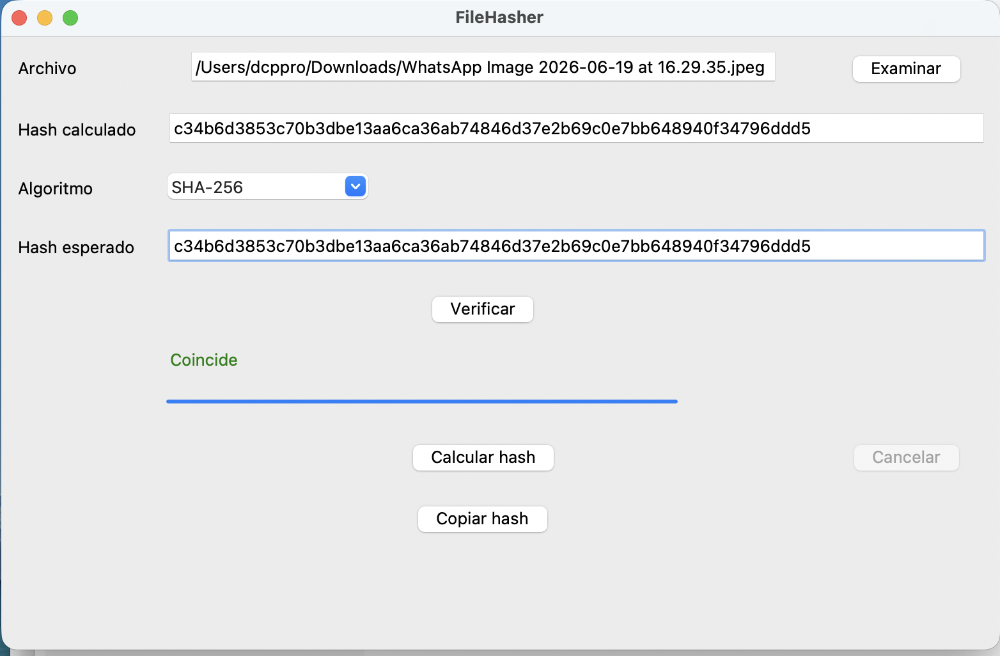

# FileHasher

[](https://www.python.org/)
[](LICENSE)
[](../../releases)
[](https://pyinstaller.org/)

Aplicación de escritorio para calcular y verificar hashes criptográficos mediante MD5, SHA-1 y SHA-256.

FileHasher es una aplicación de escritorio multiplataforma desarrollada en Python para calcular y verificar hashes criptográficos de archivos de forma rápida, sencilla y segura.

El proyecto tiene un doble objetivo:

- Proporcionar una herramienta para comprobar la integridad de archivos mediante los algoritmos MD5, SHA-1 y SHA-256.
- Servir como proyecto de aprendizaje sobre desarrollo profesional en Python, aplicando buenas prácticas de arquitectura, control de versiones, pruebas automatizadas y distribución de aplicaciones.

El desarrollo sigue un flujo de trabajo basado en Git, revisiones incrementales, análisis estático del código y pruebas automatizadas.

---

## Características

- Cálculo de hashes MD5, SHA-1 y SHA-256.
- Lectura eficiente de archivos por bloques.
- Barra de progreso durante el cálculo.
- Ejecución en segundo plano sin bloquear la interfaz.
- Cancelación segura del cálculo.
- Verificación de integridad mediante comparación de hashes.
- Copia del hash al portapapeles.
- Soporte para arrastrar y soltar archivos (Drag & Drop).
- Gestión robusta de errores.
- Compatible con Windows, macOS y Linux.

---

## Capturas

### Ventana principal



### Cálculo de hash



### Verificación



---

## Instalación

Clonar el repositorio:

```bash
git clone https://github.com/TUUSUARIO/FileHasher.git
```

Entrar en el proyecto:

```bash
cd FileHasher
```

Instalar dependencias:

```bash
pip install -e .
```

Ejecutar:

```bash
python -m filehasher.app
```

---

## Uso

1. Selecciona un archivo mediante el botón **Examinar** o arrástralo sobre la aplicación.
2. Elige el algoritmo de hash.
3. Pulsa **Calcular hash**.
4. Copia el resultado o compáralo con un hash esperado mediante **Verificar**.

---

## Arquitectura

```text
UI
 │
 ▼
Controller
 │
 ▼
Hashing
 │
 ▼
hashlib

```

La aplicación sigue una arquitectura por capas:

- **ui.py**: interfaz gráfica desarrollada con Tkinter.
- **controller.py**: lógica de coordinación entre la interfaz y el cálculo.
- **hashing.py**: cálculo de hashes y gestión del progreso.

---

## Estructura del proyecto

```text
FileHasher/
├── assets/
├── docs/
├── src/
│   └── filehasher/
│       ├── app.py
│       ├── controller.py
│       ├── hashing.py
│       └── ui.py
├── tests/
├── README.md
├── LICENSE
└── pyproject.toml
```

---

## Tecnologías utilizadas

- Python 3.13
- Tkinter
- tkinterdnd2
- hashlib
- pathlib
- threading
- pytest
- Ruff
- Black
- Pyright
- PyInstaller
- Git
- GitHub

---

## Pruebas

El proyecto incorpora pruebas automatizadas mediante **pytest**.

Ejecutar todas las pruebas:

```bash
pytest -v
```

Las pruebas cubren tanto el motor de cálculo de hashes como la lógica de verificación implementada en el controlador.

Actualmente incluye pruebas para:

- SHA-256
- SHA-1
- MD5
- Archivo vacío
- Algoritmo no soportado
- Cancelación
- Comparación de hashes

---

## Roadmap

### Versión 1.0

- [x] MD5
- [x] SHA-1
- [x] SHA-256
- [x] Barra de progreso
- [x] Cancelación
- [x] Drag & Drop
- [x] Verificación
- [x] Pruebas automatizadas

### Versión 2.0

- [ ] Historial
- [ ] Procesamiento de múltiples archivos
- [ ] Exportación de resultados
- [ ] Tema oscuro
- [ ] GitHub Actions

Las versiones futuras podrán incorporar nuevas funcionalidades manteniendo la compatibilidad con la arquitectura actual.

## Licencia

Este proyecto se distribuye bajo la licencia MIT. Consulta el archivo `LICENSE` para obtener más información.

---

Este proyecto continúa en desarrollo y evolucionará mediante versiones incrementales siguiendo un flujo de trabajo basado en Git y buenas prácticas de ingeniería del software.
